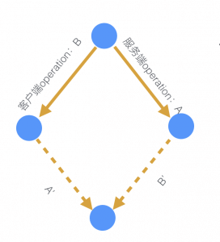
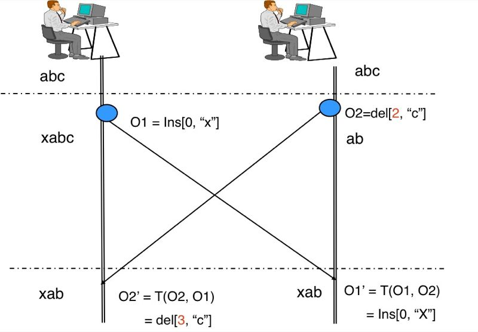
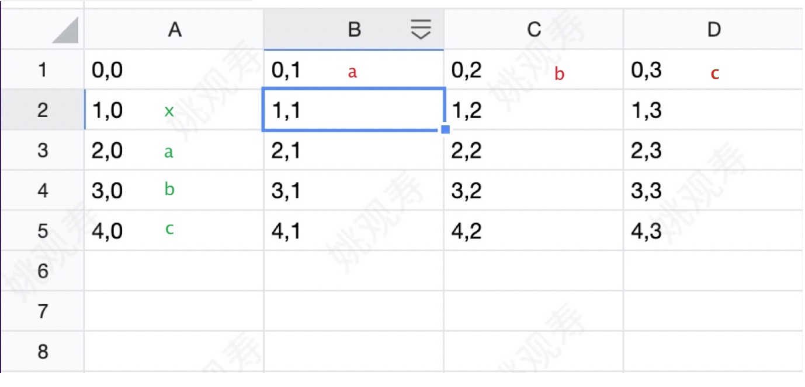
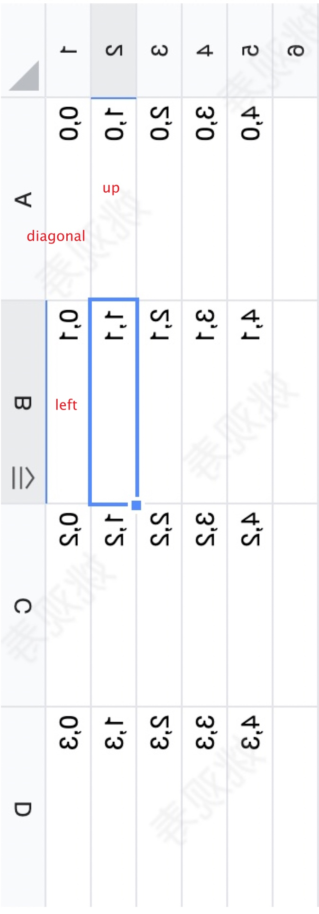

# operational-transformation 算法源码分析

Operational Transformation算法解决的问题是如何merge基于相同的状态产生的不同的操作序列。 

首先ot算法解决了什么问题呢？我们来先看看产生的问题

## 举个栗子

服务器内容是abc，用户A输入xabc，用户B输入ab，这个个时候恰好发给服务器，那么，服务应该要怎么做？其实我们最终想要的结果是xab。

### 解决方案一：丢了丢了

这可能是最简单粗暴的方法了，我发现有冲突，就告诉用户，主子，咱这里有冲突了，臣妾解决不了啊。但是显然这会经常出现，然后主子就把你打入冷宫了。然后按照优先顺序排列需要丢失了A用户输入的x，最后变成了ab

### 解决方案二：锁

有些小伙伴想到，上面出现问题，还不是因为大家编辑了都立即应用了，我们编辑后不立即应用不就好了，而且历史告诉我们，有冲突加锁应该可以解决。 

加锁问题是这个时候a在输入，b不能编辑，那协同就没多大意义了。

### OT算法

OT算法全名叫**Operation Transformation**，你看从名字就对应了上面我说的转变算法。

那ot算法是如何做到a，b用户文本都不丢失的呢？

他是这样做的，如果当有两个版本的时候，他A用户先和服务器做对比，然后通过算法知道x是插入的，abc是保留的。然B用户也和原来服务器内容做对比，知道了c是被删除的，ab是保留的，然后他在通过 xabc和ac对比，知道x是新增的，ab是保留的，c是被删除的。这样一合并就得到了xabc 如一下两个图





那来看看我们的源码，源码一共分为这几个文件

tests.js，apply.js，client.js，errors.js，messages.js，operations.js，ot.js，xform.js

那么我们来显看看这几个文件功能 

### tests.js测试用例文件

```
/*
 * @Date: 2011-05-02 09:43:09
 * @Author: Yao guan shou
 * @LastEditors: Yao guan shou
 * @LastEditTime: 2022-03-21 16:45:39
 * @FilePath: /operational-transformation/tests/tests.js
 * @Description:
 */

(function (global, factory) {
  typeof exports === "object" && typeof module !== "undefined"
    ? (module.exports = factory(
        require("../operations"),
        require("../xform"),
        require("../apply")
      ))
    : typeof define === "function" && define.amd
    ? define("tests", ["operations", "xform", "apply"], factory)
    : (global.tests = factory(global.operations, global.xform, global.apply));
})(this, function (ops, xform, apply) {
  "use strict";

  var numTests = 0;
  var failed = 0;

  function test(
    original, // 旧的文本，服务器文本
    a, // 文本a
    b, // 文本b
    expected // 合并后的预期文本
  ) {
    var operationsA = ops.operation(
      original, // 旧的文本，服务器文本
      a // 新的文本
    );
    // return
    var operationsB = ops.operation(
      original, // 旧的文本，服务器文本
      b // 新的文本
    );

    // ot 算法函数
    xform(operationsA, operationsB, function (ap, bp) {
      numTests++;
      // try {
      console.log(original + " -< (" + a + ", " + b + ") >- " + expected);

      var docA = apply(operationsA, original);
      var finalA = apply(bp, docA);
      console.log("  " + original + " -> " + docA + " -> " + finalA);
      if (finalA !== expected) {
        throw new Error(finalA + " !== " + expected);
      }

      var docB = apply(operationsB, original);
      var finalB = apply(ap, docB);
      console.log("  " + original + " -> " + docB + " -> " + finalB);
      if (finalB !== expected) {
        throw new Error(finalB + " !== " + expected);
      }
      // } catch (e) {
      //   failed++;
      //   console.log("  ERROR: " + e.message);
      // }
    });
  }

  test("abc", "xabc", "ab", "xab");

  // // test("nick", "Nick", "nick is cool", "Nick is cool");
  // // test("sudo", "sumo", "suo", "sumo");
  // // test("hello", "Hello", "Hello", "Hello");
  // // test("care", "are", "are", "are");
  // // test("air", "fair", "lair", "flair");

  // // console.log(numTests - failed + " / " + numTests + " tests passed.");

  return test;
});

```

首先我们看到他是先调用   operations.operation() 的方法传入服务器的文本和用户A，与B文本，然后创建一个对象我们来看看这里做了什么。

```

```

我们看到operation 需要两个参数 第一个是旧的文本，就是服务器文本，第二个参数是用户输入文本，然后他调用makeEditsTable方法，该方法就是把文本生成一个链表结构，那么他数据结构是怎么样子呢？

假如我们的测试用例是

```
   var operationsA = ops.operation(
      "abc", // 旧的文本，服务器文本
     "xabc" // 新的文本
    );
```

首先他会枚举新的字符串

```
// 循环新的文本字符串的长度
    for (i = 1; i <= m; i += 1) {
      console.log("insert(t.charAt(i - 1)=", insert(t.charAt(i - 1)));
      console.log("get(table, i - 1, 0)=", get(table, i - 1, 0));
      console.log(
        "cons=",
        cons(
          // return "i" + chars;  从第0个开始
          insert(t.charAt(i - 1)), //返回 return "i" + chars;  从第0个开始
          get(table, i - 1, 0) // 获取上一个table缓存的数据
        )
      );

        // 添加到把对象edits添加到table对象中
      put(
        table, // 把字符串缓存成对象数组
        i, // 索引
        0,
        cons(
          // return "i" + chars;  从第0个开始
          insert(t.charAt(i - 1)), //返回 return "i" + chars;  从第0个开始
          get(table, i - 1, 0) // 获取上一个table缓存的数据
        )
      );
    }
```

然后通过

```
// 循环新的文本字符串的长度
    for (i = 1; i <= m; i += 1) {
      console.log("insert(t.charAt(i - 1)=", insert(t.charAt(i - 1)));
      console.log("get(table, i - 1, 0)=", get(table, i - 1, 0));
      console.log(
        "cons=",
        cons(
          // return "i" + chars;  从第0个开始
          insert(t.charAt(i - 1)), //返回 return "i" + chars;  从第0个开始
          get(table, i - 1, 0) // 获取上一个table缓存的数据
        )
      );

        // 添加到把对象edits添加到table对象中
      put(
        table, // 把字符串缓存成对象数组
        i, // 索引
        0,
        cons(
          // return "i" + chars;  从第0个开始
          insert(t.charAt(i - 1)), //返回 return "i" + chars;  从第0个开始
          get(table, i - 1, 0) // 获取上一个table缓存的数据
        )
      );
    }
    
    
    
    
```

然后我们来看看数据结构


他是一个对象，其实用图来表示，感觉有些二维数组的意思我们来看看图表示是怎么样子的


其实他是通过一个这样的矩形格式然后一个个数据填充到表格中。

一开始他会填充一个默认的 0,0数据进去,这个时候我们看到table对象中的car字符串是这样子的  ix，ia，ib，ic这个是什么意识呢？其实这个是新字符串，他呢前面加i意思是标识这个是插入

我们来先看看以下这几个方法 这个就是这几个方法的作用

```
  // 插入
  function insert(chars) {
    return "i" + chars;
  }

  // 删除
  function del(chars) {
    return "d" + chars;
  }

  // 保留
  function retain(n) {
    return "r" + String(n);
  }
```

那他是如何形成这个table的阵列数据呢，我们来看看这几个方法。

我们来看看put，cons， get

然后通过put方法把

```
  // 添加到把对象edits添加到table对象中
  function put(table, x, y, edits) {
    //对应的key
    return (table[String(x) + "," + String(y)] = edits);
  }
```

然后我们再看看cons方法

```
   //连接上一个和下一个对象 形成一个链表
  function cons(car, cdr) {
    return {
      car: car, //返回 return    "i" + chars;    "d" + chars;   "r" + chars;
      cdr: cdr, // 获取上一个table缓存的数据 把他变成一个链表连接起来
      length: 1 + cdr.length, // 添加长度
      toArray: toArray, // 链表转换数组
    };
  }

```

连起来是这样

```
    // 循环新的文本字符串的长度
    for (i = 1; i <= m; i += 1) {
      // 添加到把对象edits添加到table对象中
      put(
        table, // 把字符串缓存成对象数组
        i, // 索引
        0,
        cons(
          // return "i" + chars;  从第0个开始
          insert(t.charAt(i - 1)), //返回 return "i" + chars;  从第0个开始
          get(table, i - 1, 0) // 获取上一个table缓存的数据 把上一级的字符串链表插入到子链表中
        )
      );
    }
```

然后到枚举旧的文本

```
 // 旧的文本，服务器文本字符串的长度
    for (j = 1; j <= n; j += 1) {
      console.log("del(t.charAt(j - 1)=", del(s.charAt(j - 1)));
      console.log("get(table, 0, j=", get(table, 0, j - 1));
      console.log(
        "cons=",
        cons(
          // return "i" + chars;  从第0个开
          del(s.charAt(j - 1)), // 返回 return "d" + chars;  从第0个开始
          get(table, 0, j - 1) // 获取上一个table缓存的数据
        )
      );
      // 添加到把对象edits添加到table对象中
      put(
        table, // 把字符串缓存成对象数组
        0, //
        j, // 索引
        cons(
          del(s.charAt(j - 1)), //
          get(table, 0, j - 1)
        )
      );
    }
```

再次我们来看看table数据是怎么样子


  因为abc是服务器的文本所以前面显示是d，这个时候还没做对比。所以刚开始是以删除开头。


接下来他是要把刚才那个图表的数据填满，这个时候只是填满了红色框框的数据，那么剩余的数据如何填充呢，我们来看看



            ```
    //   两层嵌套 时间复杂度为 o(n^2)  空间复杂度为 o(2*long)
      //  新的"abc"
      for (i = 1; i <= m; i += 1) {
        // 旧的字符串"xabc"
        for (j = 1; j <= n; j += 1) {
          // console.log('i=',i)
          // console.log('j=',j)
      
          //选择单元格对比上面和左边对比算出下一个table格的数据，这里用到的类似动态规划算法
          chooseCell(
            edits, //  链表
            i, // 新的字符串索引
             j, //   旧的字符串索引 j先 开始增长 再到  i 增长 所以开始 1,1->1,2->1,3
            function (direction, prevEdits) {
              // 在插入新的字符串
              switch (direction) {
                case "left":  // 插入
                  debugger;
                  put(edits, i, j, cons(insert(t.charAt(i - 1)), prevEdits));
                  break;
                case "up":   // 删除
                  debugger;
                  put(edits, i, j, cons(del(s.charAt(j - 1)), prevEdits));
                  break;
                case "diagonal": // 删除或者保留
                  debugger;
                  // 判断新的文本和旧的文本是否相同 d r i 等元素
                  if (
                    s.charAt(j - 1) === // 旧的字符串"at"
                    t.charAt(i - 1) //  新的"tff"
                  ) {
                    console.log("j - 1=", j - 1);
                    console.log("i - 1=", i - 1);
                    console.log("s=", s, "t=", t);
                    debugger;
                    // 如果是相同则保留
                    put(edits, i, j, cons(retain(1), prevEdits));
                  } else {
                    debugger;
                    // 如果不相同则记录需要删除
                    put(
                      edits,
                      i,
                      j,
                      cons(
                        insert(t.charAt(i - 1)), // 插入新的文本
                        cons(del(s.charAt(j - 1)), prevEdits) // 删除旧的文本
                      )
                    );
                  }
                  break;
                default:
                  throw new TypeError("Unknown direction.");
              }
            }
          );
        }
      }
      console.log('edits=================',edits)
      console.log('m========',m)
      console.log('n========',n)
            ```

 这里调用chooseCell方法然后根据chooseCell方法判断对比上面，左边和左右上对角推出右边的数据

一开始选择的是 1,0然后推导出1,1的数据，然后根据1,1的数据推导出1,2的数据，然后根据1,2的数据推导出1,3的数据

第二趟是根据2,0数据推导出推导出2,1的数据，然后根据2,1的数据推导出2,2的数据，然后根据2,2的数据推导出2,3的数据

第三趟是根据3,0数据推导出推导出3,1的数据，然后根据3,1的数据推导出3,2的数据，然后根据3,2的数据推导出3,3的数据

第四趟是根据4,0数据推导出推导出4,1的数据，然后根据4,1的数据推导出4,2的数据，然后根据4,2的数据推导出4,3的数据

这种算法比较明显像动态规划法。

那么我们来看看chooseCell方法是如何动态判断数据的,这里比较复杂我是打了好多个断点和log才看懂

```
//选择单元格对比上面和左边对比算出下一个table格的数据，这里用到的类似动态规划算法
  function chooseCell(
    table, // 链表
    x, //   新的文本字符串指针
    y, //  旧的文本字符串指针
    k // 回调函数
  ) {
    // 获取上一次编辑
    var prevEdits = get(
        table,
        x, //   新的文本字符串指针
        y - 1 //  旧的文本字符串指针
      ),
      min = prevEdits.length,
      direction = "up";

    console.log("table=", table);
    console.log("prevEdits=", prevEdits);
    console.log("prevEdits x y=", "x=", x, "y-1=", y - 1);
    console.log("up=", "x=", x, "y - 1 =", y - 1);
    console.log("left=", "x - 1=", x - 1, "y=", y);
    console.log("diagonal=", "x - 1=", x - 1, " y - 1=", y - 1);
    console.log("add=", "x=", x, " y =", y);
     
    if (
      get(
        table,
        x - 1, //   新的文本字符串指针
        y //  旧的文本字符串指针
      ).length < min
    ) {
      prevEdits = get(
        table,
        x - 1, //   新的文本字符串指针
        y //  旧的文本字符串指针
      );
      min = prevEdits.length;
      direction = "left";
      // debugger;
    }

    if (
      get(
        table,
        x - 1, //   新的文本字符串指针
        y - 1 //  旧的文本字符串指针
      ).length < min
    ) {
      prevEdits = get(
        table,
        x - 1, //   新的文本字符串指针
        y - 1 //  旧的文本字符串指针
      );
      min = prevEdits.length;
      direction = "diagonal";
    
    }
    console.log("direction=",direction);
    debugger;
    return k(direction, prevEdits);
  }
```

  我看看到这里循环先取 1,0值   direction = "up";默认为上面

和0,1对比如果0,1里面的length小于1,0的length的话就确定为direction = "left"; 左边

然后上面条件不成立则在取  x - 1,   y - 1  这个时候 就取到 0,0的，所以第一次 direction = "diagonal";对角

但是这个，我刚开始用看这个图对应代码都不正确


然后我翻转了几下图才发现他程序应该是这样表达的，但是这样看图有点吃力倒着看。但是图和程序对上了。



然后这样走一遍，在回调一个函数 这里会根据direction方向判断是插入还是删除还是保留

```
function (direction, prevEdits) {
              // 在插入新的字符串
              switch (direction) {
                case "left": // 插入
                  put(edits, i, j, cons(insert(t.charAt(i - 1)), prevEdits));
                  console.log("edits1========", edits);
                  debugger;
                  break;
                case "up": // 删除
                  debugger;
                  put(edits, i, j, cons(del(s.charAt(j - 1)), prevEdits));
                  break;
                case "diagonal": // 删除或者保留
                  // 判断新的文本和旧的文本是否相同
                  if (
                    s.charAt(j - 1) === // 旧的字符串"abc"
                    t.charAt(i - 1) //  新的"xabc"
                  ) {
                    console.log("j - 1=", j - 1);
                    console.log("i - 1=", i - 1);
                    console.log("s=", s, "t=", t);

                    // 如果是相同则保留
                    put(edits, i, j, cons(retain(1), prevEdits));
                    console.log("edits==========", edits);
                    debugger;
                  } else {
                    debugger;
                    // 如果不相同则记录需要删除
                    put(
                      // 链表
                      edits,
                      i,
                      j,
                      cons(
                        insert(t.charAt(i - 1)), // 插入新的文本
                        cons(
                          //
                          del(s.charAt(j - 1)), // 删除旧的文本
                          prevEdits
                        )
                      )
                    );
                  }
                  break;
                default:
                  throw new TypeError("Unknown direction.");
              }
            }
```

最后table是这样子，

```
 {
  "0,0": { length: 0 },
  "1,0": { car: "ix", cdr: { length: 0 }, length: 1 },
  "2,0": {
    car: "ia",
    cdr: { car: "ix", cdr: { length: 0 }, length: 1 },
    length: 2,
  },
  "3,0": {
    car: "ib",
    cdr: {
      car: "ia",
      cdr: { car: "ix", cdr: { length: 0 }, length: 1 },
      length: 2,
    },
    length: 3,
  },
  "4,0": {
    car: "ic",
    cdr: {
      car: "ib",
      cdr: {
        car: "ia",
        cdr: { car: "ix", cdr: { length: 0 }, length: 1 },
        length: 2,
      },
      length: 3,
    },
    length: 4,
  },
  "0,1": { car: "da", cdr: { length: 0 }, length: 1 },
  "0,2": {
    car: "db",
    cdr: { car: "da", cdr: { length: 0 }, length: 1 },
    length: 2,
  },
  "0,3": {
    car: "dc",
    cdr: {
      car: "db",
      cdr: { car: "da", cdr: { length: 0 }, length: 1 },
      length: 2,
    },
    length: 3,
  },
  "1,1": {
    car: "ix",
    cdr: { car: "da", cdr: { length: 0 }, length: 1 },
    length: 2,
  },
  "1,2": {
    car: "ix",
    cdr: {
      car: "db",
      cdr: { car: "da", cdr: { length: 0 }, length: 1 },
      length: 2,
    },
    length: 3,
  },
  "1,3": {
    car: "ix",
    cdr: {
      car: "dc",
      cdr: {
        car: "db",
        cdr: { car: "da", cdr: { length: 0 }, length: 1 },
        length: 2,
      },
      length: 3,
    },
    length: 4,
  },
  "2,1": {
    car: "r1",
    cdr: { car: "ix", cdr: { length: 0 }, length: 1 },
    length: 2,
  },
  "2,2": {
    car: "db",
    cdr: {
      car: "r1",
      cdr: { car: "ix", cdr: { length: 0 }, length: 1 },
      length: 2,
    },
    length: 3,
  },
  "2,3": {
    car: "dc",
    cdr: {
      car: "db",
      cdr: {
        car: "r1",
        cdr: { car: "ix", cdr: { length: 0 }, length: 1 },
        length: 2,
      },
      length: 3,
    },
    length: 4,
  },
  "3,1": {
    car: "ib",
    cdr: {
      car: "r1",
      cdr: { car: "ix", cdr: { length: 0 }, length: 1 },
      length: 2,
    },
    length: 3,
  },
  "3,2": {
    car: "r1",
    cdr: {
      car: "r1",
      cdr: { car: "ix", cdr: { length: 0 }, length: 1 },
      length: 2,
    },
    length: 3,
  },
  "3,3": {
    car: "dc",
    cdr: {
      car: "r1",
      cdr: {
        car: "r1",
        cdr: { car: "ix", cdr: { length: 0 }, length: 1 },
        length: 2,
      },
      length: 3,
    },
    length: 4,
  },
  "4,1": {
    car: "ic",
    cdr: {
      car: "ib",
      cdr: {
        car: "r1",
        cdr: { car: "ix", cdr: { length: 0 }, length: 1 },
        length: 2,
      },
      length: 3,
    },
    length: 4,
  },
  "4,2": {
    car: "ic",
    cdr: {
      car: "r1",
      cdr: {
        car: "r1",
        cdr: { car: "ix", cdr: { length: 0 }, length: 1 },
        length: 2,
      },
      length: 3,
    },
    length: 4,
  },
  "4,3": {
    car: "r1",
    cdr: {
      car: "r1",
      cdr: {
        car: "r1",
        cdr: { car: "ix", cdr: { length: 0 }, length: 1 },
        length: 2,
      },
      length: 3,
    },
    length: 4,
  },
};
```

其实我们发现用动态规划一下图是可以猜测出下一个框框中的字符串是多少，红色的abc是代表删除的，绿色代表添加的，然后他们形成一个十字架交叉循环，如果是遇到相同的则是r保留，没遇到相同的红色代表d删除，绿色代表i插入


